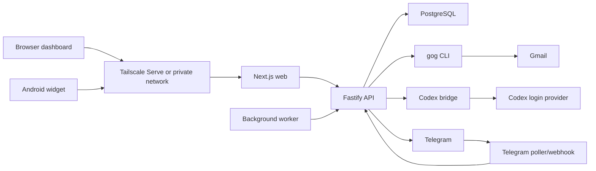

## Executive summary

RyanOS is currently designed as a private, single-owner home-server tool. Under that deployment model, the main security dependency is network privacy: Tailscale must be the access control layer, because the application itself does not yet enforce user authentication or authorization on most API routes. If the web/API surface becomes reachable from the public internet, or from an untrusted tailnet device, the current API shape would allow broad read/write access as the default `local-owner` user.

The Gmail integration is intentionally limited in important ways: it uses `gog` with no-send flags, asks AI only for proposal generation, validates proposal tool calls with Zod, and does not currently mark, label, draft, or send email. That is a good starting safety posture. The main Gmail risks are different: high-sensitivity email content is imported into the system, untrusted email text is sent to an AI provider, and the current source persistence stores a raw Gmail payload while labeling the source as summary retention. Given the user stated Gmail contains health, financial, work, and other sensitive data, Gmail should be treated as a highest-sensitivity data source.

Top issues to fix before broader exposure are:

1. Add real owner authentication and route authorization before using Tailscale Funnel or any public access.
2. Remove or lock down unauthenticated generic execution surfaces such as `/v1/tools/:name/invoke`, `/v1/messages`, `/v1/email/scan`, and `/v1/dev/snapshot`.
3. Stop storing raw Gmail payloads by default; persist only minimum metadata, summaries, hashes, and explicit user-approved proposal artifacts.
4. Require Telegram sender allowlists and webhook secret validation for any Telegram deployment.
5. Require the Codex bridge bearer token and restrict bridge binding to localhost or a narrow private interface.
6. Add store-level ownership checks for object ID reads and writes before multi-user or public-auth operation.
7. Add deployment checks that fail on placeholder secrets, empty allowlists, and public exposure without auth.

## Scope and assumptions

Reviewed repository: `/Users/ryan/Projects/active/ryanos`.

Primary deployment assumption: current intended deployment is a private home-server app, accessed through Tailscale Serve, with no known active breach. Tailscale Funnel is explicitly documented as disabled until real owner authentication exists.

Secondary deployment assumption: this review also ranks future public-auth and Tailscale-Funnel risks because the codebase has public-facing deployment affordances and the user asked what improvements are needed for the tool to be secure as needed.

Data sensitivity assumption: Gmail data is high sensitivity. The mailbox can contain health, financial, work, personal, and security-relevant content. RyanOS task, shopping, recurrence, daily plan, Telegram, setup, and AI prompt data can also reveal sensitive personal routines and account metadata.

Out of scope:

- Live infrastructure penetration testing.
- Verification of the user's actual Tailscale ACLs, DNS, firewall, or hosted server state.
- Review of the upstream `gog` implementation beyond how RyanOS invokes it.
- Formal cryptographic proof of secret storage.

Evidence reviewed included:

- API server routes and setup flow in `apps/api/src/app.ts`.
- Gmail triage and gog integration in `apps/api/src/email-triage.ts` and `apps/api/src/gog-gmail.ts`.
- AI provider, Codex bridge, and prompt-handling code in `packages/ai/src`.
- Store and secret handling in `packages/db/src`.
- Tool definitions in `packages/core/src`.
- Worker, web proxying, Android widget settings, Docker, systemd, and deployment docs.
- `pnpm audit --prod` and `pnpm test`.

## System model

### Primary components

- Next.js web dashboard in `apps/web`.
- Fastify API server in `apps/api`.
- PostgreSQL database accessed through Drizzle in `packages/db`.
- Background worker in `apps/worker`.
- Gmail integration through the `gog` CLI in `apps/api/src/gog-gmail.ts`.
- AI interpretation through Codex login execution or a local Codex bridge in `packages/ai`.
- Telegram poller and webhook routes in `apps/api/src/app.ts`.
- Android widget client in `apps/android`.
- Docker Compose and systemd deployment assets under `docker-compose.server.yml`, `docker/`, and `ops/`.

### Data flows and trust boundaries

- Browser or Android client -> Tailscale/private network -> Next.js web/API proxy.
- Next.js web -> Fastify API through `/api/:path*` rewrites.
- Worker -> Fastify API for scheduled daily plan and email scan tasks.
- API -> PostgreSQL for durable user data, external sources, proposals, audit logs, provider accounts, and encrypted provider secrets.
- API -> `gog` CLI -> Gmail account state and Gmail message APIs.
- API -> AI provider or Codex bridge -> local Codex execution.
- Telegram cloud -> webhook or poller -> API message handling.
- Admin/operator -> setup routes, environment files, keyring state, and systemd services.

#### Diagram

## Assets and security objectives

| Asset | Security objective |
| --- | --- |
| Gmail messages, snippets, metadata, account identifiers, and proposed actions | Minimize collection and retention; prevent unauthorized read, prompt injection escalation, and unintended email actions. |
| RyanOS tasks, daily plans, recurrences, shopping items, and messages | Only the owner or approved local services can read or mutate state. |
| Provider secrets, master key, gog keyring password, Telegram token, Codex bridge token | Never expose through logs, API responses, repo history, client bundles, or broad filesystem access. |
| AI prompts and outputs | Treat external content as untrusted; prevent tool misuse, data leakage, and stored prompt injection. |
| Telegram integration | Only allowed Telegram users can create messages or trigger AI/tool flows. |
| Codex bridge and local Codex login | Keep network-local, authenticated, and constrained to intended tasks. |
| PostgreSQL data | Preserve confidentiality and integrity; enforce ownership on every object-level access. |
| Home-server availability | Prevent unauthenticated callers from burning AI, Gmail, DB, or worker resources. |

## Attacker model

### Capabilities

- Reach the web/API service through accidental public exposure, Tailscale Funnel, misconfigured reverse proxy, compromised tailnet device, or local network access.
- Send crafted HTTP requests directly to API routes, bypassing the web UI.
- Submit arbitrary `userId`, item IDs, provider account IDs, proposal IDs, messages, and tool inputs where routes accept them.
- Send malicious emails that will later be fetched and summarized by Gmail triage.
- Send Telegram updates if webhook URL or bot token is exposed, or if sender allowlist is absent.
- Trigger repeated scans, AI calls, or worker-facing routes if reachable.
- Inspect logs or backups if host-level or deployment-secret handling is weak.
- Influence future multi-user behavior by exploiting current object ID based access paths.

### Non-capabilities

- No assumed root access to the host.
- No assumed compromise of Tailscale, Google, Telegram, OpenAI/Codex, PostgreSQL, or npm registries.
- No assumed direct ability to decrypt encrypted provider secrets without the master key.
- No assumed Gmail send capability through the current Gmail scan/proposal path.

## Entry points and attack surfaces

- Web UI proxied API requests through `apps/web/next.config.ts`.
- Fastify routes in `apps/api/src/app.ts`, including setup, email, mobile, item, tool invocation, messages, Telegram, and dev snapshot routes.
- Worker-to-API HTTP calls for scheduled jobs.
- Android widget API configuration, including base URL and caller-provided user ID.
- Telegram webhook and poller processing.
- Gmail message ingestion through `gog`.
- AI provider calls and Codex bridge HTTP endpoints.
- PostgreSQL object ID lookup and mutation methods.
- Docker/systemd environment files and mounted secrets.
- Supply-chain inputs: pnpm packages, Docker base image, and `gog` GitHub release tarball.

## Top abuse paths

1. Publicly reachable unauthenticated API takeover: attacker reaches `/api/*`, passes `userId=local-owner`, reads widget/task state, invokes tools, completes items, sends messages, and triggers scans.
2. Generic tool execution abuse: attacker posts to `/v1/tools/:name/invoke` with valid schema input and bypasses UI/AI confirmation expectations.
3. Gmail data over-retention: sensitive Gmail message payloads are persisted as raw external source metadata and later exposed through DB backups, logs, future routes, or host compromise.
4. Email prompt injection: attacker sends a crafted email that is included in AI triage context and causes misleading proposals, unsafe reply text, or polluted task data.
5. Telegram spoofing or broad sender acceptance: an exposed webhook or empty `TELEGRAM_ALLOWED_USER_IDS` lets outsiders create messages and trigger AI/tool flows.
6. Codex bridge exposure: a bridge bound to `0.0.0.0` without a strong bearer token allows network callers to use the owner's local Codex login as an interpreter.
7. Object ID authorization bypass: future multi-user/public-auth callers use raw item, proposal, provider account, or source IDs to read or mutate another user's data.
8. Resource exhaustion: unauthenticated callers repeatedly trigger Gmail scans, AI interpretation, message ingestion, or expensive list routes, exhausting API, DB, Gmail, or Codex quotas.
9. Secret/configuration drift: placeholder tokens, empty allowlists, broad bind addresses, or copied `.env` files turn intended private-only controls into public vulnerabilities.
10. Supply-chain compromise: unpinned or unverified `gog` binary downloads and vulnerable transitive packages introduce build/runtime risk.

## Threat model table

| ID | Threat | Current likelihood | Current impact | Future public impact | Evidence | Priority | Recommended controls |
| --- | --- | --- | --- | --- | --- | --- | --- |
| TM-001 | No application authentication on core API routes. Network access is effectively owner access. | Medium under private Tailscale; high if any untrusted tailnet device can connect. | High | Critical | API routes accept caller `userId`, often defaulting to `local-owner`; deployment docs rely on Tailscale and warn against Funnel before auth. | P0 before public exposure | Add owner auth middleware, session checks, CSRF for browser mutations, service auth for worker calls, and remove client-supplied `userId` as authority. |
| TM-002 | Unauthenticated generic mutation/execution routes bypass intended UX confirmations. | Medium | High | Critical | `/v1/tools/:name/invoke`, `/v1/messages`, item complete/toggle routes, and email scan routes are callable directly if API is reachable. | P0 | Require auth on all state routes, disable generic invoke in production or restrict to an allowlisted admin role, and centrally enforce tool confirmation metadata. |
| TM-003 | Gmail raw payload retention expands blast radius of a Gmail integration compromise. | High once Gmail scan is enabled | High | High | `upsertSourceForMessage` sets `retentionClass: "summary"` while storing `metadata.raw: input.message.raw`. | P0 | Store only minimal headers/snippet/summary, hash external IDs, encrypt or expire optional raw captures, and add a migration to purge existing raw payloads. |
| TM-004 | Untrusted email content can prompt-inject the AI triage path. | Medium | Medium to High | High | Gmail message subject/body/snippet are sent to the AI; trust sanitizer exists in `packages/ai/src/trust.ts` but is not wired into Gmail triage. | P1 | Wrap email content in explicit untrusted-source delimiters, run the sanitizer, preserve provenance in proposals, and keep all Gmail-derived actions user-confirmed. |
| TM-005 | Telegram integration can accept unwanted users or spoofed webhook traffic. | Medium if Telegram enabled with empty allowlist or exposed webhook | High | High | Authorization permits all senders when `TELEGRAM_ALLOWED_USER_IDS` is empty; webhook handler does not validate a Telegram secret token header. | P1 | Fail setup outside dev when allowlist is empty, require Telegram webhook secret validation, and keep poller-only mode for private deployments. |
| TM-006 | Codex bridge can expose a logged-in local AI interpreter if bound broadly or left tokenless. | Low to Medium depending host bind | High | Critical | Bridge token is optional; docs/config include `RYANOS_CODEX_BRIDGE_HOST=0.0.0.0` in server examples with bootstrap narrowing expected elsewhere. | P1 | Require bearer token outside local dev, bind to localhost or Docker bridge IP only, block Tailscale exposure, and add systemd/network hardening. |
| TM-007 | Object-level authorization gaps become cross-user data access bugs. | Low current single-owner | Medium | High | Store methods such as raw `getItem`, provider account, external source, proposal, and shopping item lookups are ID-only; routes often check ownership at route level inconsistently. | P1 before multi-user | Move ownership predicates into store methods and route helpers; make object fetches require `userId` unless explicitly admin/internal. |
| TM-008 | Secret and setup drift can weaken all other controls. | Medium | High | High | Example env files include placeholder bridge and gog secrets; Telegram allowlist can be empty; secrets are mounted into containers and read by systemd services. | P1 | Add startup validation by profile, reject `change-me`, require master key file permissions, document backup handling, and avoid env secrets where file-backed secrets are available. |
| TM-009 | Resource exhaustion through unauthenticated expensive routes. | Medium if reachable | Medium | High | Gmail scan, AI message processing, and worker endpoints lack visible auth/rate limits; email scan lock is per user but still caller-triggered. | P2 | Add auth, rate limits, request body limits, per-user job queues, scan cooldowns, and quota-aware AI/Gmail guards. |
| TM-010 | Supply-chain and dependency risk. | Low to Medium | Medium | Medium | `docker/app.Dockerfile` downloads `gog` release without checksum verification; `pnpm audit --prod` reports moderate `postcss` and `js-yaml` advisories. | P2 | Verify `gog` checksums/signatures, automate dependency audit, update affected packages when patched, and pin image digests for production. |

## Criticality calibration

Current private Tailscale deployment:

- Critical: a route or deployment mistake that exposes the unauthenticated API outside trusted devices; Gmail raw-payload retention because the data is highly sensitive and already inside the trust boundary once enabled.
- High: Telegram allowlist/webhook misconfiguration, Codex bridge token/bind mistakes, generic invoke exposure to any untrusted private-network caller.
- Medium: prompt injection that only creates proposals, resource exhaustion from trusted network callers, dependency advisories without known direct exploit path.

Future public-auth deployment:

- Critical: any unauthenticated API route, generic tool execution route, missing object ownership checks, or exposed Codex bridge.
- High: Gmail prompt injection and raw retention, Telegram spoofing, missing rate limits, weak setup/secret validation.
- Medium: supply-chain hardening and operational log/backup controls.

The highest security design decision is whether RyanOS remains strictly private-network single-owner software or becomes an internet-reachable authenticated app. The current code is acceptable only if the private-network boundary is maintained carefully and the user's trusted device set is small.

## Focus paths for security review

| Path | What to review next | Why it matters |
| --- | --- | --- |
| `apps/api/src/app.ts` | Add global auth middleware and route-level authorization tests. | Most exploitable risks are route exposure and caller-supplied identity. |
| `apps/api/src/app.ts` | Remove or guard `/v1/tools/:name/invoke`, `/v1/messages` tool calls, `/v1/dev/snapshot`, and direct scan triggers. | These routes provide broad capability without a strong trust check. |
| `apps/api/src/email-triage.ts` | Replace raw Gmail payload persistence with minimal summary retention and a purge migration. | Gmail is the most sensitive integration and currently over-retains. |
| `apps/api/src/email-triage.ts` | Integrate untrusted-content sanitization and provenance for AI triage. | Email is attacker-controlled input to the AI. |
| `apps/api/src/gog-gmail.ts` | Preserve `--gmail-no-send` and `--sanitize-content`; add tests that fail if no-send is removed from search/get paths. | Prevents accidental capability expansion. |
| `packages/db/src/ryan-store.ts` | Convert raw ID getters/mutators to require `userId` or an explicit internal/admin context. | Prevents future cross-user object access. |
| `packages/core/src/tools.ts` | Enforce `confirmation` centrally for mutating/high-risk tools. | UI/AI confirmation metadata should be a policy, not documentation. |
| `packages/ai/src/trust.ts` | Apply sanitizer to Gmail, Telegram, and any external-source text before model submission. | Existing defensive code should protect real ingestion paths. |
| `packages/ai/src/codex-bridge-server.ts` | Require token outside dev and restrict binding. | Prevents a local logged-in Codex channel from becoming a network service. |
| `apps/api/src/app.ts` Telegram section | Require sender allowlist and webhook secret validation. | Stops spoofed or unwanted Telegram-origin actions. |
| `apps/worker/src/index.ts` | Add service-to-service auth and cooldown-aware job triggering. | Worker routes should not be callable by arbitrary clients. |
| `apps/android` | Replace stored `userId` authority with an authenticated mobile token. | Android widget settings are not an authorization boundary. |
| `docker-compose.server.yml` | Keep API unpublished and web localhost-bound unless app auth is complete. | Preserves the intended private deployment boundary. |
| `docker/app.Dockerfile` | Verify `gog` release checksum or signature. | Reduces supply-chain risk for a credentialed Gmail integration. |
| `.env.server.example` and setup flow | Reject placeholders, empty allowlists, and broad bridge binding in production profile. | Prevents insecure defaults from shipping accidentally. |
| Test suite | Add negative security tests for unauthenticated access, object ownership, Gmail retention, and Telegram authorization. | Security behavior needs regression coverage. |

## Quality check

- Scope includes architecture, API routes, Gmail integration, AI/Codex integration, Telegram, Android, worker, deployment, secrets, database access, and supply chain.
- Findings distinguish current private Tailscale risk from future public-auth risk.
- Gmail review accounts for the user's high-sensitivity mailbox content.
- Findings are grounded in repository code and deployment docs.
- `pnpm audit --prod` found two moderate advisories: `postcss <8.5.10` through Next and `js-yaml <=4.1.1` through Graphile Worker/Cosmiconfig.
- `pnpm test` passed after review: package build checks plus AI, core, and API test suites passed.
